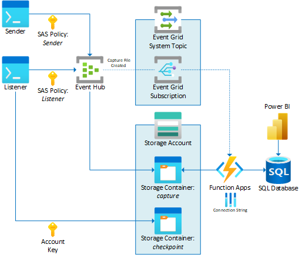

# poc-event-hub
Proof of concept for sending messages to and receiving messages from an Event Hub Instance.

This codebase was adapted from:
- [Send or receive events from Azure Event Hubs using Python (latest) - Azure Event Hubs | Microsoft Docs](https://docs.microsoft.com/en-us/azure/event-hubs/event-hubs-python-get-started-send)
- [Tutorial: Send Event Hubs data to data warehouse - Event Grid - Azure Event Grid | Microsoft Docs](https://docs.microsoft.com/en-us/azure/event-grid/event-grid-event-hubs-integration)
- [azure-event-hubs/samples/e2e/EventHubsCaptureEventGridDemo at master · Azure/azure-event-hubs · GitHub](https://github.com/Azure/azure-event-hubs/tree/master/samples/e2e/EventHubsCaptureEventGridDemo)

## Architecture Overview


A message producer generates messages and sends them to the Event Hub.  The Event Hub captures ingested events to a storage account once per minute and generates a corresponding event.

A message consumer subscribes to the Event Hub to listen for new messages. A Function App handles new capture file events by inspecting the file for events to log to a database.

A Power BI report displays analytics from the database.

## Installation
1. Clone the repo locally.
1. Deploy the terraform infrastructure. (partial)
1. Deploy the Azure Function.
1. Deploy the terraform infrastructure. (complete)
1. Deploy the SQL database script.
1. Create two shared access policies at the Event Hub Namespace resource.
    * Sender with Send access.
    * Listener with Listen access.
1. Create a secrets.json file with the necessary prerequisites.

```json
{
    "sender": {
        "event_hub_send_conn_str": "Endpoint=sb://<EVENT HUB NAMESPACE>.servicebus.windows.net/;SharedAccessKeyName=<SEND POLICY NAME>;SharedAccessKey=<SEND POLICY KEY>",
        "event_hub_name": "<EVENT HUB INSTANCE NAME>"
    },
    "receiver": {
        "blob_conn_str": "DefaultEndpointsProtocol=https;AccountName=<STORAGE ACCOUNT NAME>;AccountKey=<STORAGE ACCOUNT ACCESS KEY>;EndpointSuffix=core.windows.net",
        "blob_container_name": "event-hub-checkpoint",
        "event_hub_receive_conn_str": "Endpoint=sb://<EVENT HUB NAMESPACE>.servicebus.windows.net/;SharedAccessKeyName=<RECEIVE POLICY NAME>;SharedAccessKey=<RECEIVE POLICY KEY>",
        "event_hub_name": "<EVENT HUB INSTANCE NAME>"
    }
}
```

## listener
Subscribes to the Event Hub Instance consumer group and displays received messages.

### Prerequisites
```python
pip install asyncio
pip install azure.eventhub
pip install azure-eventhub-checkpointstoreblob-aio
```

A SAS policy at the Event Hub Namespace with `Listen` claim.

## sender
Sends messages to the Event Hub Instance.

### Prerequisites
```python
pip install asyncio
pip install azure.eventhub
```

A SAS policy at the Event Hub Namespace with `Send` claim.

Add the CPChem Root CA to Python's certificate store given by `certifi.where()`.

## terraform
This provisions an Event Hub Namespace with one Event Hub Instance. It also provisions a Storage Account and a blob Container for the Event Hub to use for maintaining a processing checkpoint.

### Prerequisites

```python
pip install azure-storage-blob
```
